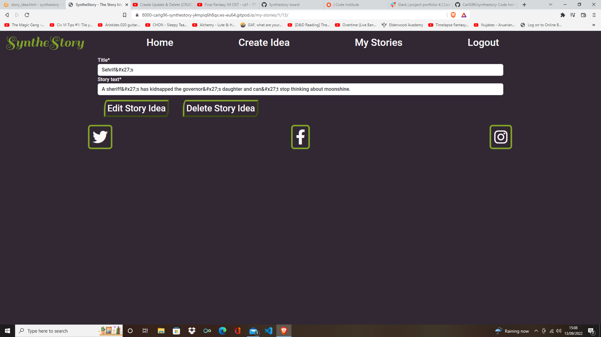

# SyntheStory 

SyntheStory is a website that randomly generates story ideas for authors. A user can filter ideas by genre and choose whether they want a plot idea or character idea. A user can then save. $$$edit$$$ or delete these ideas on their own personal account.

https://www.youtube.com/watch?v=qNifU_aQRio tutorial for navbar
pixabay for images
https://www.youtube.com/watch?v=GUEB9FogoP8&list=PLDyQo7g0_nsXEOxGlAgccV8fu-cHZnI5B&index=8 for animation of logo

# Bugs

I tried to use an internal script in the HTML to pre-populate a form by changing it's 'value' attribute in the HTML with data passed in from the view. This caused Django to represent any unusual characters (such as apostrophes) with data such as '&#x27;' as a safety precaution. I then tried to use an external JavaScript file to do the same but this resulted in it not reading the Django template properly and showing no data. To rectify the problem I passed in an a dictionary of values to the form in the view as an initial value which populated the fields without bugs.