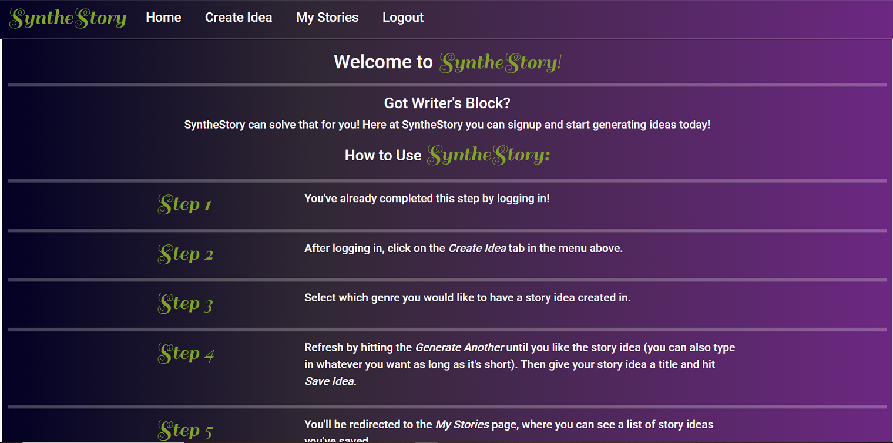
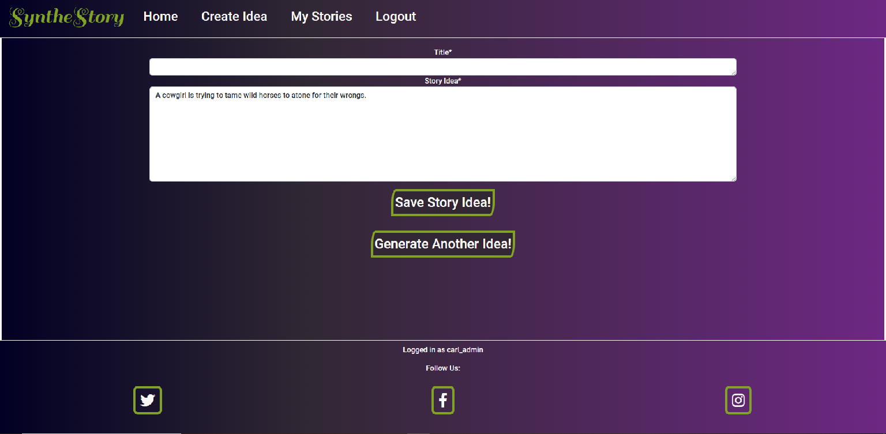
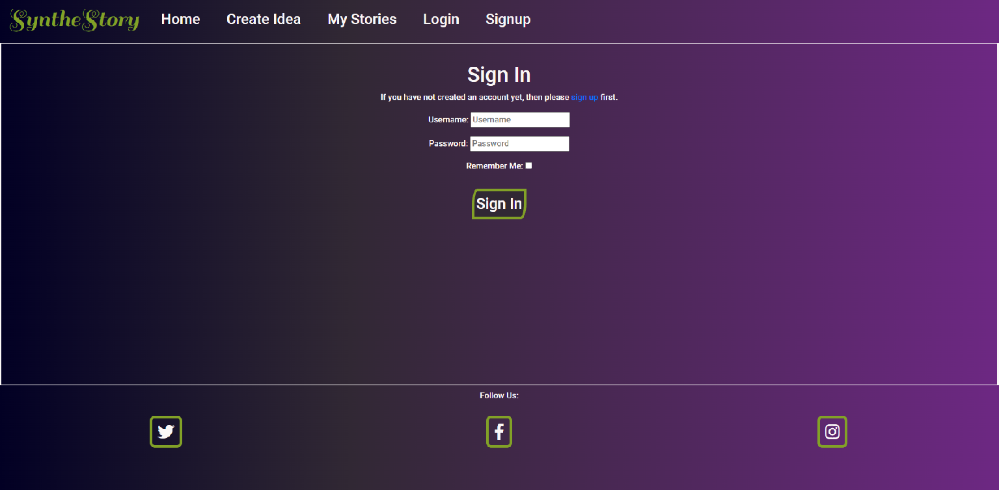
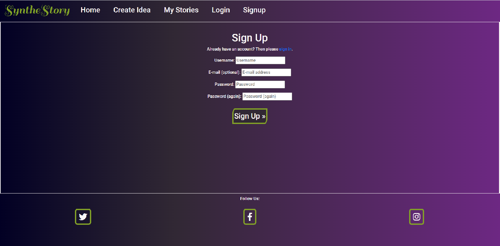
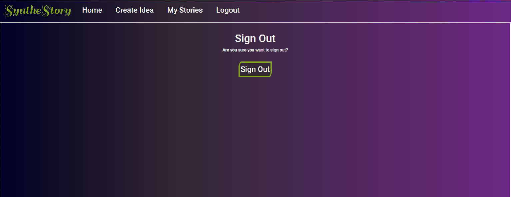
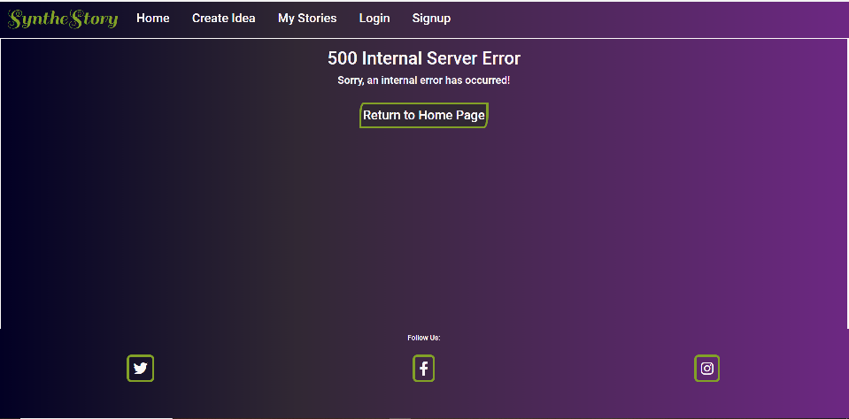

# SyntheStory 

## Purpose of SyntheStory

SyntheStory is a website that randomly generates story ideas for authors. The 'story idea' is a central concept in SyntheStory and represents a short and sweet premise for a story. The need for a website like SyntheStory would be that authors are sometimes lacking in inspiration and a site generating random ideas can help with filling that void.

After creating an account on SyntheStory, a user can filter by genre and SyntheStory will randomly generate a story idea for the user by pulling from a database containing only that particular genre's ideas. These ideas are created by the admin of the site and additional snippets of ideas and genres can be created by the admin in order to extend the usability of the site.

After a user has given a story idea a title, they can edit (editing can be done before saving), save and delete stories by accessing their own area of the website called 'My Stories'. This way a user can refer to their ideas, change randomly generated ones that don't <em>quite</em> fit and even create entirely original ones. SyntheStory is a website designed to get an author's writing off the ground and NOT a place to actually write stories so there is a character limit on the length of story idea.

You can find the deployed SyntheStory site by following the link [here](https://synthestory.herokuapp.com/)

## Features/ Pages

### Homepage
The Homepage contains a brief introduction and instructions on how to use SyntheStory. It is the only 'main page' (meaning pages other than error pages or pages to do with login) which does not require login access.

### Genre Page
The Genre page contains a list of genres from which the user can choose to narrow down a generated story idea. They can click on the links in the cards to take them to a Genre Type page which will display a Story Idea with their chosen genre.

### Genre Type Page
The Genre Type page contains a randomly generated Story Idea taken from a 'bank' of Story pieces in the database related to a specific genre. The user can save a story idea using the Save Story Idea! button or refresh the page with a new randomly generated Story Idea by clicking the Generate Another Idea! button. The user can also edit the Story Idea field text and both fields must be filled in before a submission can be made.

### My Stories Page
The My Stories Page represents the user's saved stories and as such is unique to each user (see MANUAL_TESTS.md for information on how users are prevented from interfering with other users' data). The My Stories page contains links to each of the users saved Story Ideas.

### Story Idea Page
The Story Idea Page is unique to each Story Idea and can only be accessed by the user who's profile corresponds to that particular Story Idea. In the Story Idea page Story Ideas can be edited by pressing the Edit Story Idea button, editing and clicking the Save Edited idea button or deleted by pressing the Delete Story button.

### Login, Logout and Signup pages
The Login, Logout and Signup pages act as you would imagine, giving people the opportunity to make accounts and work the site. Many parts of the site will be blocked off and will redirect to the Login page unless a user is logged in.

### Error Pages
The 403, 404 and 500 error pages are there to indicate errors to a user. The 404 page will occur if the user tries to access something which does not exist. The 403 page will occur if the user tries to interact with another user's Story Ideas and the 500 page will occur if there is an internal server error. The user will be redirected to the homepage from there.

## Future Features
A feature that is far beyond the scope of this project but might be an idea for the future would be to somehow link each generated Story Idea up to an API to do with a text-to-image diffusion model which would display an AI generated image displaying the Story Idea in picture form. I am not entirely sure on the achievability of this at the current moment and am ignorant of any potential copyright issues that would occur but believe it might help inspire an author with imagery.

A feature that was not included was a mandatory email signup feature as this was deemed to be outside the scope of the project and unnecessary.

A feature that would auto-generate a title based on the story text of a story idea was considered as an idea but was not included due to the work necessary to make it 'fit' with the story idea organically. I estimated this feature would take more time than it was worth as most users would probably change the title anyway.

## Data Model

Five data models were created for SyntheStory: Genre, StoryStart, StoryMiddle, StoryEnd and StoryIdea. The User model was also imported from ` django.contrib.auth.models. `

### Genre Model

The Genre Model represents a single genre by which the user can filter which ideas are generated from. Each Genre instance contains a title, an image and a description to display to the frontend and also contains a creation date which is used to order the Genre data. The Genre Model relates to the StoryStart, StoryMiddle and StoryEnd models by acting as a foreign key for them. New Genres can be created by an admin of the site, allowing extensibility to SyntheStory's random generation in the future.

### StoryStart, StoryMiddle and StoryEnd Models

The StoryStart, StoryMiddle and StoryEnd Models are very similar and could have been derived from a base class but were decided not to due to there only three of them and the story text fields changed size on each of them. They represent corresponding parts of a randomly generated idea and contain story text, creation date and genre(which is a foreign key for Genre) fields. The genre foreign key interacts with the view to make sure that once the user has filtered their ideas by genre only that idea is pulled from when SyntheStory generates random ideas. New StoryStarts, StoryMiddles and StoryEnds can be created by the admin of the site, allowing extensibility to SyntheStory's random generation in the future.

### StoryIdea Model

The StoryIdea Model represents a saved story idea that is connected to a user. This is used to present the user with their story ideas and allow them to edit and delete them as needs be. Each StoryIdea instance contains a user(foreign key connected to User), title, story text and a creation date and updated on date. The title and story text fields are used to display information on the frontend and the creation date is used to refer to when it was created and the updated on date is used to control te order that the story ideas are presented to the user in their My Stories page.

### Entity Relationship Diagram

## Imported Modules, Installed Apps

### Python Modules

- random
    - Used for randrange function to randomise the story idea generated.
- Django
    - login_required decorators for login functionality.
    - render, redirect, get_object_or_404, HttpResponseForbidden for routing.
    - messages for displaying messages to the user when certain actions are completed.
    - User for user model.
    - Textarea for fields in forms.
    - TestCase for testing.

### External Requirements
asgiref==3.5.2
cloudinary==1.29.0 For use with dealing with static files on uploaded website.
dj-database-url==1.0.0 Allows deployment for Heroku url parsing.
dj3-cloudinary-storage==0.0.6 Django-Cloudinary storage system.
Django==3.2.15 Django is the framework used for this project.
django-allauth==0.51.0 For Django authorisation.
django-crispy-forms==1.14.0 Used for forms to be added to templates.
gunicorn==20.1.0 
oauthlib==3.2.1
psycopg2==2.9.3 
PyJWT==2.4.0
python3-openid==3.2.0
pytz==2022.2.1
requests-oauthlib==1.3.1
sqlparse==0.4.2

## Agile Planning

SyntheStory was created using an agile planning method and utilised the GitHub Projects Kanban Board.
[Link to Kanban Board for SyntheStory](https://github.com/users/CarlG96/projects/2/views/1)

### Sprint Method

The SyntheStory project was developed in a series of sprints. Each sprint ran for 7 days and was tracked using GitHub's Project Milestones and were attached to user stories when completed to signify which sprint they were completed in. The sprints started at Sprint 0 and ran till Sprint 4. Each user story was broken down in to tasks and assigned to an epic, and these epics were also written as user stories. Each user story was designated a number of 'story points' using GitHub's labels (for example, a label of 'SP:1' would signify the user story was estimated to take 1 story point to complete). The epic user stories were not given story points as they were composed of the generic user stories. 

User stories were also assigned labels of 'Must Have', 'Should Have', 'Could Have' and 'Won't Have'. These were assigned when a user story was placed in the 'In Progress' section of the Kanban board. These labels could change between sprints. For example, if a user story had a 'Should Have' in Sprint 1 it would likely have a 'Must Have' in Sprint 2. The 'Won't Have' label was only applied to a single user story. This story was making email signup mandatory and this was because I decided that it was outside the scope of this project.

### Epics and User Stories
The SyntheStory project was planned in a series of epics which were broken down into user stories. Here are links to see the user stories of each epic.

[Setup User Stories](https://github.com/users/CarlG96/projects/2/views/1?filterQuery=label%3A%22Setup+%28epic%29%22)

[Generate Story User Stories](https://github.com/users/CarlG96/projects/2/views/1?filterQuery=label%3A%22Generate+Story+%28epic%29%22)

[Edit Story User Stories](https://github.com/users/CarlG96/projects/2/views/1?filterQuery=label%3A%22Edit+Story+%28epic%29%22)

[Delete Story User Stories](https://github.com/users/CarlG96/projects/2/views/1?filterQuery=label%3A%22Delete+Story+%28epic%29%22)

[Authorisation User Stories](https://github.com/users/CarlG96/projects/2/views/1?filterQuery=label%3A%22Authorisation+%28epic%29%22)

[Testing User Stories](https://github.com/users/CarlG96/projects/2/views/1?filterQuery=label%3A%22Testing+%28epic%29%22) 

[Visual/ Introductory User Stories](https://github.com/users/CarlG96/projects/2/views/1?filterQuery=label%3A%22Visual%2F+Introductory+%28epic%29%22)

## Wireframes

Here are the wireframes created before the SyntheStory project was developed. The homepage screen is the only one that shows a non-logged in navigation bar due to all others only being accessible when logged in and the navigation bar after being logged in staying the same.

### Homepage when not logged in (desktop view)

### Homepage when not logged in (mobile view)

### Signup page (desktop view)

### Signup page (mobile view)

### Login page (desktop view)

### Login page (mobile view)

### My Stories page (desktop view)

### My Stories page (mobile view)

### Edit Item page/ Story Idea page (desktop view)

### Edit Item page/ Story Idea page (mobile view)

### Genre page (desktop view)

### Genre page (mobile view)

### Genre Type page (desktop view)

### Genre Type page (mobile view)

## Technology Used

* HTML
    * Used to create the templates for SyntheStory's pages.
* CSS 
    * Used to style the templates for SyntheStory's pages.
* JavaScript
    * Used in HTML templates in short scripts to add interactivity to SyntheStory's pages.
* Bootstrap 
    * Bootstrap was used to create easier CSS using the grid system, to allow messages and other JavaScript functionality.
* Python 
    * Used for the backend of the SyntheStory project
* Django
    * Used as framework for the SyntheStory project.
* PostgreSQL
    * Database used for SyntheStory project.
* Lucidchart
    * Used for the development of a flowchart to concept the ideas.
* GitHub 
    * Used for the repository and linked with Heroku to deploy the website.
* Gitpod
    * Used for development of the application.
* Heroku
    * Used for the deployment of the application.
* Colormind
    * Used to determine colors used on SyntheStory webpages. Creates color schemes. The colors used for SyntheStory were:
        * #faf7f7 for a light-shade white.
        * #8b875a for a light-accent.
        * 82a127 for a green main-brand.
        * #734f36 for a brown dark accent.
        * #312834 for a dark shade which was converted to rgba values for the gradient shading of the background.
        * #b60a0a for a red for the delete button.
* Favicon.io
    * Used for creating the favicons.
* Cloudinary
    * Used for static file and image storage.
* CSS Gradient
    * Used for CSS color gradient code.
* Google Fonts
    * For fonts used in SyntheStory.
* Font Awesome
    * Used for icons.
* Balsamiq
    * Used to create wireframes.

## Testing

### HTML
Used the HTML validator at (https://validator.w3.org/). Had to copy and paste from 'View Page Source' in browser in live project because of Django's templating laguage messing up the code otherwise. All HTML was valid.
### CSS 
Used the CSS validator at (https://jigsaw.w3.org/css-validator/#validate_by_input). There were errors raised regarding some colors and background colors not being valid however these are not valid errors because they are to do with the validator not recognising gradient coloring correctly. Code was created at (https://cssgradient.io/) and this code works and removing it removes the intended effect. The validator also found an error with the imported fonts from Google Fonts however this is not an error but is due to the validator not checking the imported files.
### JS
[JS Hint](https://jshint.com/) was used to check the validity of the scripts running in the templates. No errors were found.
### PEP8/ pylint
PEP8 was the style guide used for the Python code of this project and pylint was used in the Gitpod environment to check against it. Unfortunately whilst most the of the PEP8 errors were valid and easily fixable, there are numerous 'errors' left in that either cannot be fixed properly or are not actually errors. I will explain each individually:
- In settings.py pylint records `'env' imported but unused`. This is untrue and in the development environment this was used and removing it breaks SyntheStory's functionality.
- In setting.py pylint records `line too long`. This is due to the length of some password strings and cannot be adequately fixed as it require breaking the string on a new line.
- Throughout the Python code pylint repeatedly states `Class 'x' has not 'objects' member`. This is untrue and without the code it references SyntheStory does not work.
- Throughout the test code pylint repeatedly states `local variable 'x' is assigned but never used`. This is due to it being used in a TestCase setUp function and pylint not recognised it is used in other functions of the test suite after this.
- Throughout the code pylint states `redefining built in id` and `Argument name 'id' does not conform to snake_case naming style`. As 'id' was used in the Code Institute walkthrough project I believe these are not valide errors.
- pylint says in test_models.py `Unnecessarily calls dunder method __str__. Use str built in function.` This is due to str built in function being used in __str__ functions of the models to remove another error saying the __str__ method did not return a string. Either way a PEP8 error is thrown so it has been left as is.
### Lighthouse
SyntheStory was tested in Brave's Lightouse feature and was found to be fast-loading and accessible for the visually impaired.

Lighthouse check on desktop:

Lighthouse check on mobile:

### Cross browser compatibility
SyntheStory was tested in both Brave and Firefox browsers. There is a small issue of messages being unaligned with their cross in Firefox but this does not affect functionality and works in Brave.
### Manual Testing

Manual testing was carried out to ensure that SyntheStory worked correctly from a user's point of view. Details of this can be found [here](MANUAL_TESTS.md)

### Automated Testing
Automated testing was carried out using TestCase. This was used to ensure there were no 'behind the scenes' problems occurring. One problem that was highlighted was that the 403 error page was being given as a 200 response so the HttpForbidden method was used to make sure a 403 response was given when this appeared.

## Bugs

I tried to use an internal script in the HTML to pre-populate a form by changing it's 'value' attribute in the HTML with data passed in from the view. This caused Django to represent any unusual characters (such as apostrophes) with data such as '&#x27;' as a safety precaution. I then tried to use an external JavaScript file to do the same but this resulted in it not reading the Django template properly and showing no data. To rectify the problem I passed in an a dictionary of values to the form in the view as an initial value which populated the fields without bugs.

ACCOUNT_EMAIL_VERIFICATION was set to 'optional' in settings. When making fake accounts to test the signup feature using fake email addresses would cause a 500 internal server error due to the email not being sent to a valid email address but the account would still be created. As SyntheStory does not require an email address to verify account I decided to change ACCOUNT_EMAIL_VERIFICATION to 'none' to prevent internal server errors.

In automated testing, a test to return a 403 response was triggering a 200 instead. After looking into it, it appeared I was using a 200 response in my views but redirecting to a 403 template. Used the HttpResponseForbidden class from Django to get around this.

## Unfixed Bugs

Firefox messages: The messages that display on firefox browser do not have the text and cross line up correctly. As they work on brave I have left this as it may just be a discrepancy between how the browsers display the messages and it is still prefectly readable and understandable on Firefox.

## Deployment

SyntheStory was deployed on Heroku. Here are the steps to achieve this:

* Clicked on "Create new app" on Heroku account and named app 'synthestory' and selected region as 'Europe'.
* In resources, select Heroku Postgres on the Hobby Dev setting.
* Add config vars in settings, including PORT, CLOUDINARY_URL, DATABASE_URL and SECRET_KEY.
* Make sure Debug is set to False in your settings.py file in your code.
* Connect GitHub repository in Deploy section and either automatically or manually deploy.
* The site should deploy after these steps.

## Credits
* [Tutorial followed for navbar.](https://www.youtube.com/watch?v=qNifU_aQRio)
* [Pixabay](https://pixabay.com/) for images.
* [CSS Gradient](https://cssgradient.io/) used for generating code for background color.
* [favicon.io](https://favicon.io/) for the favicons used.
* [Am I Responsive?](https://ui.dev/amiresponsive) for image at the top of README.
* [Code Institute](https://codeinstitute.net/) for the walkthrough projects which helped with understanding how to structure a Django project.
* [Colormind](http://colormind.io/) for generating color schemes that I selected from.
* [Lucidchart](https://www.lucidchart.com/pages/) for the software used to create the ERD diagram.
* [Font Awesome](https://fontawesome.com/) for the icons used to link to social media.
* [Google Fonts](https://fonts.google.com/) for the fonts used in the project, which were Sail and Roboto.
